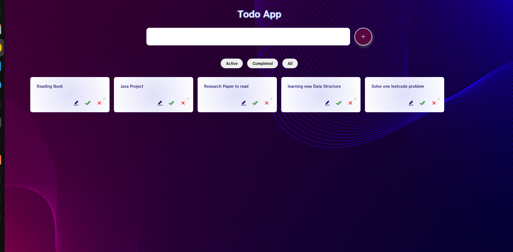

# To-Do-React-App

## About:
This is a simple To-Do application built with ReactJS, showcasing the use of HTML, CSS, JavaScript, framer-motion, React components, hooks, and state management using Redux and @reduxjs/toolkit. 

## Stack Used:

* HTML
* CSS
* JAVASCRIPT
* ReactJS (hooks, redux)

  

## Features
- **Add Task**: Users can add tasks to the list by entering a task description and pressing Enter or clicking the Add button.
- **View Tasks**: All tasks are displayed in a list format, showing the task description and a delete button.
- **Delete Task**: Tasks can be deleted from the list by clicking the delete button next to each task.

## Components
- **TaskInput**: Allows users to input new tasks and add them to the list.
- **TaskList**: Displays the list of tasks and handles task deletion.

## State Management
- **Redux**: Uses Redux to manage the application's state, including storing tasks and updating the state when tasks are added or deleted.

## Bonus Features
- **Mark Tasks as Completed**: Tasks can be marked as completed by clicking a checkbox next to the task.
- **Persistent Storage**: Tasks are saved to local storage, ensuring they are not lost on page refresh.

## Getting Started
1. Clone the repository: `git clone https://github.com/your-username/your-repo.git`
2. Install dependencies: `npm install`
3. Run the development server: `npm start`

                                                        Hope You like it!!!!!!!

